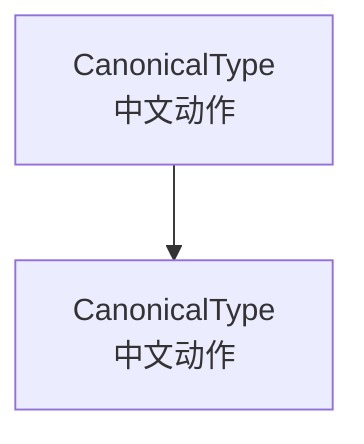

---
cssclasses:
  - comfyui-workflow-doc
---

# {{WORKFLOW_TITLE}}

> 候选版｜生成日期：{{DATE}}｜**未覆盖当前正式文档**

| 项目 | 本次核验结果 |
|---|---|
| 输入形态 | {{INPUT_MODE}} |
| 源 JSON | `{{SOURCE_PATH}}` |
| JSON SHA-256 | `{{SOURCE_SHA256}}` |
| JSON 格式/版本 | {{FORMAT_AND_VERSION}} |
| 结构覆盖 | {{STRUCTURE_COVERAGE}} |
| 参数覆盖 | {{PARAMETER_COVERAGE}} |
| 节点资料查证 | {{NODE_RESEARCH_COVERAGE}} |
| 敏感内容 | {{REDACTION_STATUS}} |
| 本机源码基线 | {{LOCAL_SOURCE_STATUS}} |
| 运行验证 | {{RUNTIME_STATUS}} |

## 1. 工作流简介与适用范围

{{PURPOSE_AND_SCOPE}}

### 第一次运行的最短路径

{{FIRST_RUN_STEPS}}

## 2. 数据流概览

{{DATAFLOW_EXPLANATION}}

## 3. 模型、插件与环境依赖

### 3.1 当前 JSON 实际引用的模型

{{MODEL_DEPENDENCIES}}

### 3.2 节点包

{{NODE_PACKAGES}}

### 3.3 版本边界

{{VERSION_BOUNDARIES}}

### 3.4 节点资料来源与查证状态

{{NODE_RESEARCH_SUMMARY}}

## 4. 从加载到运行的操作步骤

{{RUN_INSTRUCTIONS}}

## 5. 全部节点与参数详解

### 5.1 节点清单与详解导航

| ID | 节点类型 | 作用 | 参数/状态 | 详解位置 |
|---:|---|---|---|---|
| 4 | `ModelSamplingAuraFlow` | 设置采样 shift | 1 个执行参数 | [[#节点 ID 4 ModelSamplingAuraFlow 设置采样 shift\|本页详解]] |

### 5.2 参数表怎么读

当前值、源码通用默认、专项官方基线、作者建议与本机实测不是同一概念。没有证据的栏位写 `not_verified`。

{{CONTROL_SURFACE_AND_MODE_SUMMARY}}

### 5.3 {{CAUSAL_STAGE_NAME}}

#### 节点 ID 4 ModelSamplingAuraFlow 设置采样 shift

| 参数/状态 | 当前值；源码通用默认；专项官方基线 | 参数作用 | ↑/↓ 或切换分别会怎样 | 本工作流建议、风险与回退 |
|---|---|---|---|---|
| `shift` | {{CURRENT_DEFAULT_OFFICIAL}} | {{PARAMETER_EFFECT}} | {{BIDIRECTIONAL_EFFECT}} | {{ADVICE_RISK_ROLLBACK}} |

{{MORE_CAUSAL_STAGES_AND_NODE_CARDS}}

### 5.x 嵌套设置、模式与生效条件（仅在当前工作流存在时）

{{NESTED_SETTINGS_MODE_OPTIONS_AND_RUNTIME_EFFECT}}

### 5.x 说明文本字段

{{ANNOTATION_FIELDS}}

## 6. 视频讲解与作者说明

{{VIDEO_AND_AUTHOR_MATERIAL_OR_NOT_PROVIDED}}

## 7. 原始连接与语义连接

### 7.1 物理连线

{{PHYSICAL_LINKS}}

### 7.2 折叠 Reroute 后的逻辑连接

{{SEMANTIC_LINKS}}

## 8. 性能、显存与优化建议

{{CONDITIONAL_OPTIMIZATION_AND_BENCHMARK_STATUS}}

## 9. 常见问题与排错

{{WORKFLOW_SPECIFIC_TROUBLESHOOTING}}

## 10. 来源、证据和核验状态

### 10.1 证据等级

{{EVIDENCE_LEVELS_USED}}

### 10.2 节点资料查证覆盖

{{NODE_RESEARCH_MATRIX_SUMMARY}}

### 10.3 官方来源

{{OFFICIAL_SOURCES}}

### 10.4 社区来源与访问情况

{{COMMUNITY_SOURCES}}

### 10.5 未解决但已透明记录

{{UNRESOLVED_ITEMS}}
